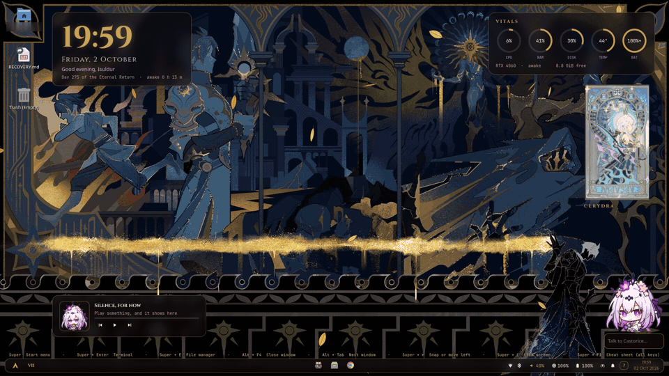

# Rice-sauce-hair
> Pun between chrysos heir and rice. I know, I am funny.

---
**An Arch Linux desktop with a local AI companion that does things for you.**

     -6B2D4A?logo=ollama&logoColor=white&labelColor=1A1013)   

It started as a themed Hyprland setup (a "rice"). Now it is a full desktop: supervised user services,
recovery tools, a health check, and a companion in the corner of the screen. You talk to her in plain or
vague words. She opens apps and files, controls windows, tabs, and settings, runs safe commands, and
hands hard tasks to Claude Code. Her model runs on your computer.

**Desktop tour:** widgets, terminals, launcher, quick settings.


**Companion demo:** she checks the system, opens the file manager, and searches YouTube.
(A preview: shown with the author's private persona, sprites, wallpaper, and art cards, which are not in this repo.
Private parts of the browser are blurred.)



## What the companion does

| You say | She does |
|---|---|
| "bring up my code thing" | Finds your IDE through the app categories and focuses its window |
| "open that pdf from yesterday" | Finds recent PDF files and opens the newest |
| "volume 20, bluetooth off, night light on" | Up to 5 steps in one request |
| "no, I meant PyCharm" | Learns the words, and does the request again |
| "close all tabs except my mail" | Asks yes or no first, because it cannot be undone |
| "why is my build failing?" | Asks Claude Code with no window (read-only) and tells you the answer |
| "install docker" | Opens Claude Code in a window, where you approve each step |

**How she thinks:** code rules first, then one plan call with JSON output (temperature 0), then one safety
policy that decides for each step: run, ask first, refuse, or hand off. A second model call speaks the real
results in her voice, so she says only what really happened.
**Safety:** terminal commands use an allowlist; titles from web pages and windows are data, never
instructions; destructive commands are refused; a hand-off to Claude Code never runs in your home folder.
Details: [The companion](companion/README.md).

## Warning: a personal project

- It was made for one laptop and tested there (Arch Linux, AMD iGPU with an NVIDIA GPU, 1920 x 1080).
- It is a snapshot of my setup, not a maintained product. Expect broken parts on your machine.
- Back up your configs first. Read [Known issues](docs/KNOWN-ISSUES.md).

## Not included

| Part | What you get |
|---|---|
| Wallpaper | A black screen |
| Companion persona and faces | A placeholder face and an example persona to fill in |
| Art cards for the desktop widget | A card that says "artwork here" |

Add your own: [Customize](docs/CUSTOMIZE.md).

## Install

```sh
git clone --recurse-submodules https://github.com/Codex-Crusader/Rice-sauce-hair ~/dotfiles
sh ~/dotfiles/install.sh --check    # a dry run: shows what it would link
sh ~/dotfiles/install.sh
```

The installer only makes links. It never moves or deletes your files: a file in the way is reported,
and you decide. `sh install.sh --remove` removes the links again. Packages, the AI model, and the login
screen are manual steps: read the [Install guide](docs/INSTALL.md).

## Layout

| Folder | What is in it |
|---|---|
| `companion/` | The companion: session, planner, policy, tools, voice, hand-off, tests |
| `desktop/` | Hyprland, the bars, notifications, launcher, desktop widgets |
| `apps/` | Kitty, fastfetch, the file manager, Flatpak overrides |
| `theme/` | The "Amphora" palette, GTK, Qt, fonts, the GRUB theme |
| `shell/` | zsh files and the fzf-tab submodule |
| `system/` | Example files for `/etc`, the safe-mode session, and the user services |
| `bin/` | Scripts: `health`, `sysupdate`, `link`, `companion-switch`, menus |

## Documents

- [Install guide](docs/INSTALL.md): packages, links, first start, optional parts.
- [Customize](docs/CUSTOMIZE.md): wallpaper, faces, cards, colors, keys, widgets.
- [The companion](docs/COMPANION.md): her persona, her files, and how to test her.
- [How the companion works](companion/README.md): the flow of a request, safety, the hand-off, privacy.
- [Known issues](docs/KNOWN-ISSUES.md) and [Recovery](docs/RECOVERY.md).

## About this repo

- A hobby project. I do not sell it, and I get no money from it.
- I keep a private repo with my full personal setup. This public copy is made from it by a script
  that removes the personal parts. If you want to ask about something, open an issue.
- The look is inspired by Honkai: Star Rail. Not affiliated with HoYoverse. No game assets are included.
- Third-party parts: the Cinzel font (SIL Open Font License, `theme/fonts/cinzel/OFL.txt`) and
  [fzf-tab](https://github.com/Aloxaf/fzf-tab) (git submodule).
- There is no license file. All rights are reserved, except for the third-party parts.

i thank claude code for helping me with the documentation. god knows it would have been BAD.
